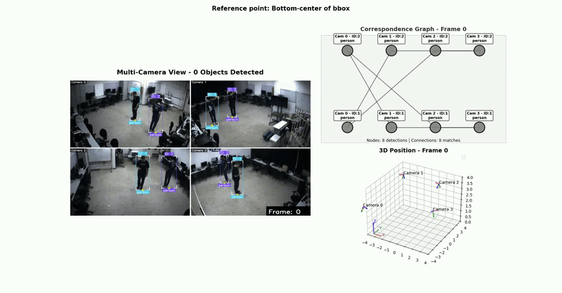
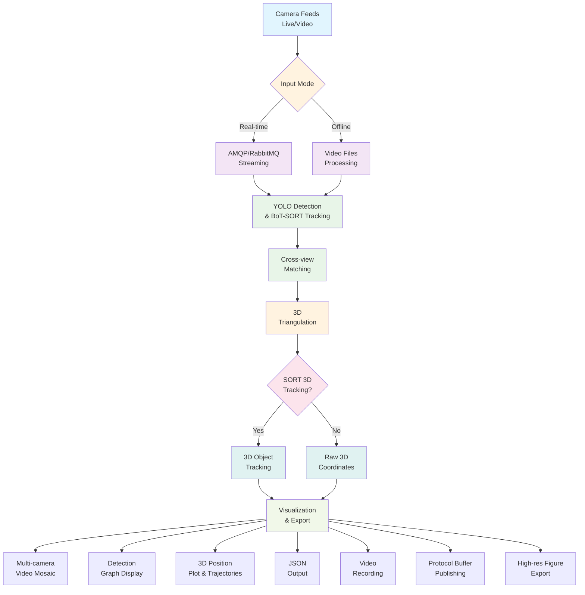
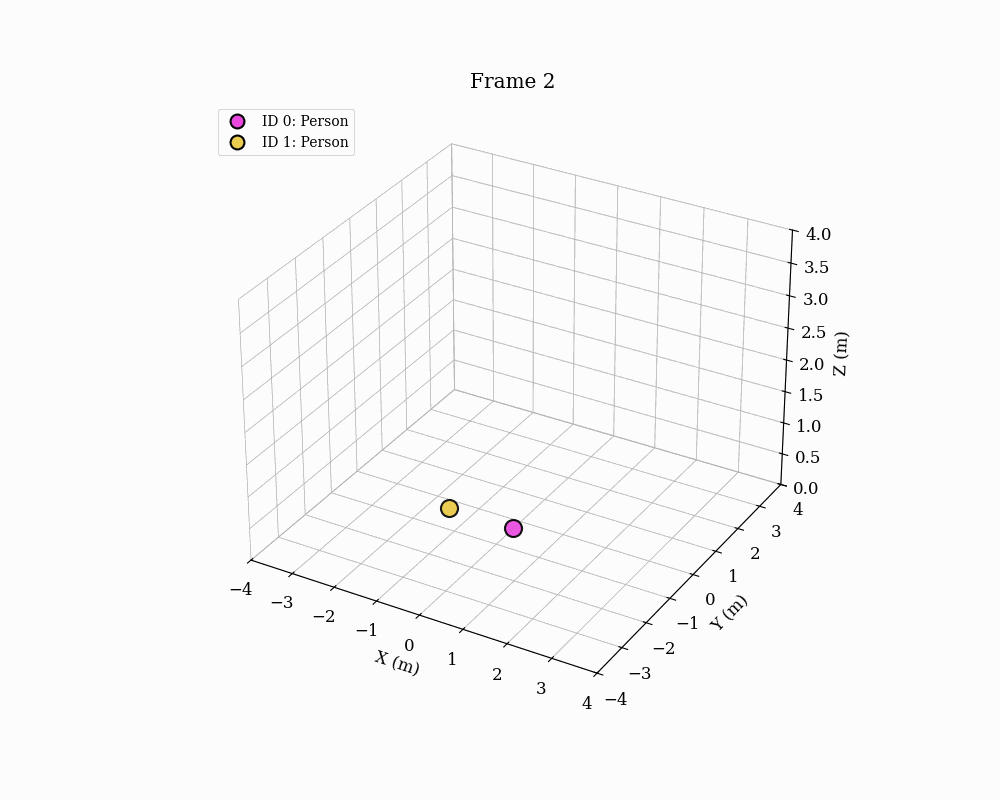
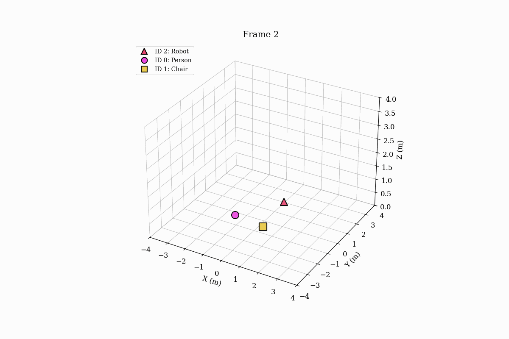
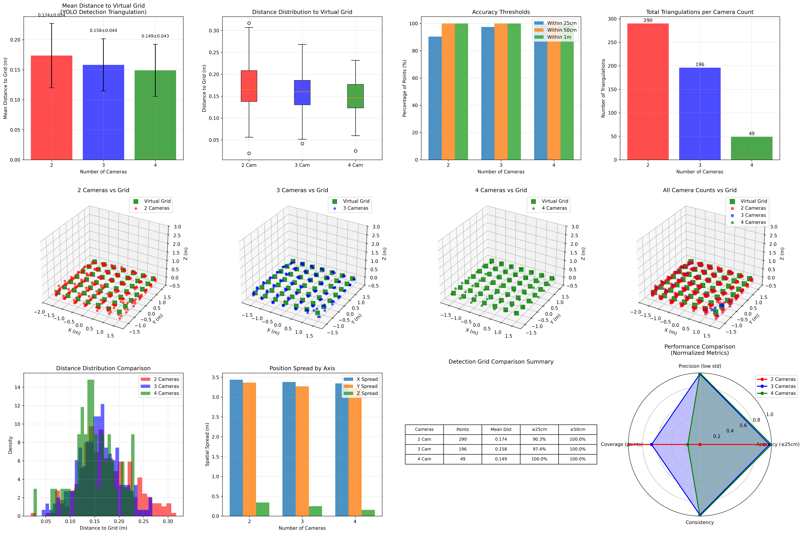
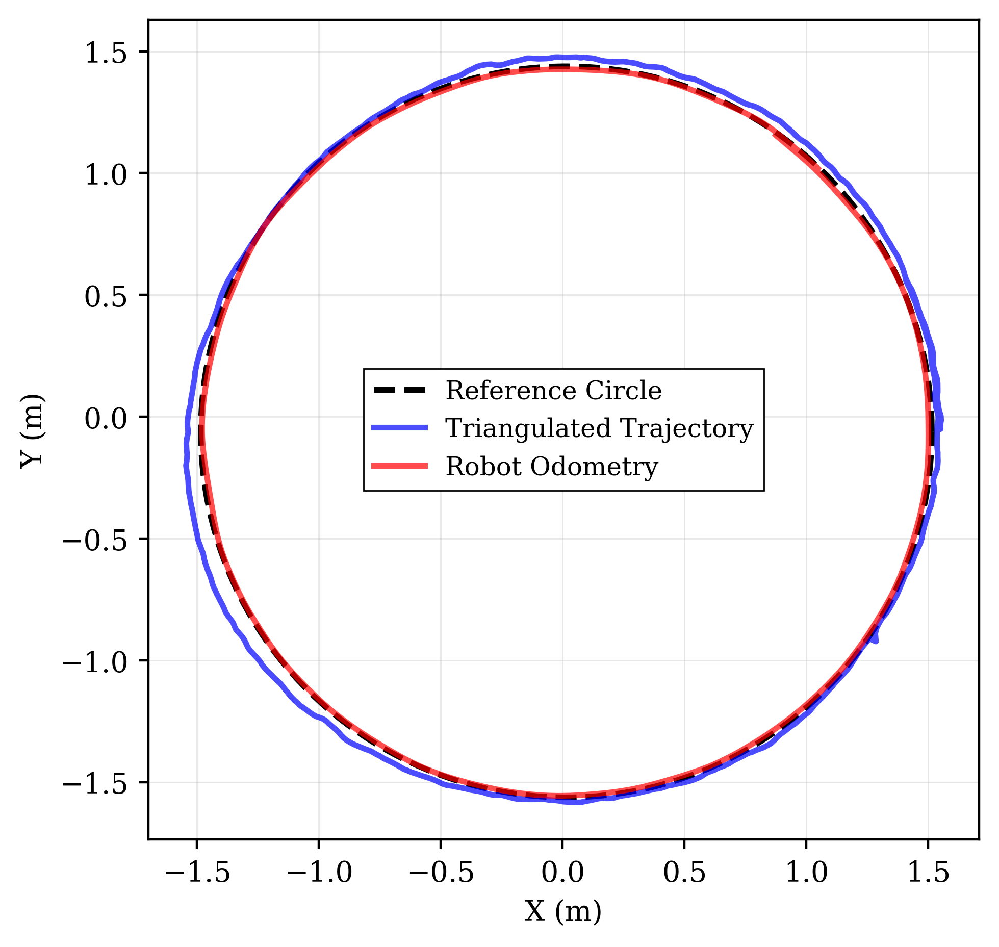

# Multi-Object Triangulation and 3D Footprint Tracking - Intelligent Space

**Multi-camera computer vision system for 3D object detection, triangulation and tracking with real-time streaming capabilities.**

<div align="center">
  
  <p><em>Multi-camera object with 3D reconstruction, 3D tracking, and visualization</em></p>
  
  <br>
  
  <h3>🎬 Video Demonstration</h3>
  <a href="https://youtu.be/jxMoNP1UV3U">
    
  </a>
  <p><em>Click above to watch the full system demonstration on YouTube</em></p>
</div>

[](https://www.python.org)
[](https://opencv.org)
[](https://pytorch.org)
[](https://ultralytics.com)
[](LICENSE)

## Overview

This project implements a comprehensive multi-camera tracking system that combines YOLO object detection, epipolar geometry-based matching, triangulation and 3D tracking to provide 3D object localization and trajectory tracking. The system supports both offline video processing and real-time streaming from live camera feeds, making it suitable for research applications, surveillance systems, and intelligent space monitoring.

### Key Features

- **Multi-Camera Synchronization**: Processes 2 or more synchronized camera feeds simultaneously
- **Real-Time Streaming**: Live processing from camera feeds via AMQP/RabbitMQ protocol

- **Epipolar Geometry Matching**: Cross-view correspondence using fundamental matrices
- **3D Triangulation**: RANSAC-based triangulation with outlier rejection
- **3D Tracking**: 3D algorithm for consistent 3D object tracking
- **Visualization**: Multi-view display with 3D plotting and detection graphs
- **Multiple Reference Points**: Configurable bounding box reference points for different tracking scenarios
- **Protocol Buffer Integration**: Real-time data publishing using Protocol Buffers
- **Comprehensive Output**: JSON coordinate export, video recording, and high-resolution figure export
- **Intelligent Space Integration**: Native support for IS-Wire communication protocol

## System Architecture



## Results and Examples

The system has been tested on various scenarios demonstrating its multi-object tracking and 3D reconstruction capabilities.

### Multi-Person Tracking

<div align="center">
  
  <p><em>Two people with 3D trajectory visualization</em></p>
</div>


### Complex Scene Analysis


<div align="center">
  
  <p><em>Dynamic tracking animation showing object interactions and trajectory evolution</em></p>
</div>

### Accuracy Validation

<div align="center">
  
  <p><em>Grid-based accuracy analysis comparing detection performance across camera combinations</em></p>
</div>

<div align="center">
  
  <p><em>Circular trajectory validation showing tracking accuracy against ground truth</em></p>
</div>

## Installation

### Prerequisites

- Python 3.8 or higher
- CUDA-compatible GPU (recommended for YOLO inference)
- OpenCV 4.5+
- Camera calibration files in JSON format

### Dependencies

Install the required packages:

```bash
pip install -r requirements.txt
```

#### Core Dependencies

- `matplotlib==3.9.3` - Plotting and visualization
- `networkx==3.4.2` - Graph-based detection management
- `numpy==1.24.0` - Numerical computing
- `opencv-python-headless==4.10.0.84` - Computer vision operations
- `ultralytics==8.3.40` - YOLO object detection
- `lap` - Linear assignment problem solver

#### Real-Time Streaming Dependencies

- `is-msgs` - Intelligent Space message definitions
- `is-wire` - AMQP/RabbitMQ communication protocol
- `google-protobuf` - Protocol Buffer serialization
- `rabbitmq-server` - Message broker for real-time communication

### Project Structure

```
Multi-Object-Triangulation_and_3D_Footprint_Tracking/
├── source/                     # Core system modules
│   ├── main.py                 # Main execution script
│   ├── config.py               # Configuration settings
│   ├── detection.py            # Object detection data structures
│   ├── video_loader.py         # Multi-camera video handling
│   ├── live_video_loader.py    # Real-time streaming handlers
│   ├── tracker.py              # YOLO tracking wrapper
│   ├── matcher.py              # Cross-view matching algorithm
│   ├── triangulation.py        # 3D reconstruction methods
│   ├── three_dimentional_tracker.py # 3D tracking
│   ├── epipolar_utils.py       # Epipolar geometry utilities
│   ├── load_fundamental_matrices.py # Camera calibration loading
│   ├── visualization_utils.py   # Visualization helpers
│   ├── graph_visualization.py   # Detection graph display
│   ├── io_utils.py             # Input/output operations
│   ├── ploting_utils.py        # Plotting utilities
│   ├── subscriber.py           # Protocol buffer subscriber
│   ├── yolo_conf.yaml          # YOLO tracking configuration
│   └── protobuf/               # Protocol buffer definitions
│       ├── config.json         # Streaming configuration
│       ├── message.proto       # Message schema definitions
│       └── message_pb2.py      # Generated Python classes
├── config_camera/              # Camera calibration files
│   ├── 0.json                  # Camera 0 parameters
│   ├── 1.json                  # Camera 1 parameters
│   ├── 2.json                  # Camera 2 parameters
│   └── 3.json                  # Camera 3 parameters
├── models/                     # YOLO model weights
│   ├── yolo11x.pt             # General object detection
├── videos/                     # Input video directory
├── tools/                      # Analysis and utility tools
├── experiments/                # Experimental data and results
├── figures/                    # Generated visualization outputs
└── docs/                      # Documentation
```

### Required File Structure

For proper operation, ensure your video files follow this naming convention:

```
videos/
├── cam0.mp4    # Camera 0 video
├── cam1.mp4    # Camera 1 video
├── cam2.mp4    # Camera 2 video
└── cam3.mp4    # Camera 3 video
```

For real-time operation, configure the message broker and camera publishers as described in the Real-Time Setup section.

## Usage

### Basic Usage

```bash
# Run with default settings (all visualizations enabled)
python source/main.py --video_path videos

# Run with 3D tracking
python source/main.py --video_path videos --use_3d_tracker

# Save 3D coordinates to JSON file
python source/main.py --video_path videos --save_coordinates --output_file tracking_results.json

# Real-time mode with live camera feeds
python source/main.py --realtime --use_3d_tracker --save_coordinates

# Real-time with Protocol Buffer publishing
python source/main.py --realtime --use_3d_tracker --publish
```

### Advanced Configuration

```bash
# Custom YOLO model and confidence threshold
python source/main.py --video_path videos --yolo_model models/custom_model.pt --confidence 0.8

# Track multiple object classes (person=0, car=2, bicycle=1)
python source/main.py --video_path videos --class_list 0 1 2

# Use feet reference point for better ground plane tracking
python source/main.py --video_path videos --reference_point feet --use_3d_tracker

# 3D tracking with custom parameters
python source/main.py --video_path videos --use_3d_tracker --max_age 15 --min_hits 2 --dist_threshold 0.8

# Headless processing (no visualization)
python source/main.py --video_path videos --headless --save_coordinates

# Export high-resolution figures
python source/main.py --video_path videos --export_figures --export_dpi 600

# Process specific cameras only
python source/main.py --video_path videos --cam_numbers 0 1 2

# Real-time with custom camera selection
python source/main.py --realtime --cam_numbers 0 2 3 --use_3d_tracker
```

### Command Line Arguments

#### Core Parameters
| Argument | Type | Default | Description |
|----------|------|---------|-------------|
| `--video_path` | str | "videos" | Path to video files directory |
| `--output_file` | str | "output.json" | Output JSON file for 3D coordinates |
| `--save_coordinates` | flag | False | Save 3D coordinates to JSON file |
| `--use_3d_tracker` | flag | True | Enable SORT 3D tracking algorithm |
| `--realtime` | flag | False | Process real-time camera feeds |
| `--publish` | flag | False | Publish to Protocol Buffer channel |

#### Camera Parameters
| Argument | Type | Default | Description |
|----------|------|---------|-------------|
| `--cam_numbers` | int[] | [0,1,2,3] | Camera numbers to process |

#### YOLO Parameters
| Argument | Type | Default | Description |
|----------|------|---------|-------------|
| `--yolo_model` | str | "models/yolo11x.pt" | Path to YOLO model file |
| `--confidence` | float | 0.6 | Detection confidence threshold |
| `--class_list` | int[] | [0] | Object classes to track (0=person) |

#### 3D Tracking Parameters
| Argument | Type | Default | Description |
|----------|------|---------|-------------|
| `--max_age` | int | 10 | Maximum frames without detection |
| `--min_hits` | int | 3 | Minimum detections before tracking |
| `--dist_threshold` | float | 1.0 | Maximum association distance (m) |

#### Matching Parameters
| Argument | Type | Default | Description |
|----------|------|---------|-------------|
| `--distance_threshold` | float | 0.4 | Epipolar distance threshold |
| `--drift_threshold` | float | 0.4 | Ambiguous match threshold |

#### Reference Point Options
| Option | Description | Use Case |
|--------|-------------|----------|
| `bottom_center` | Bottom center of bbox | General tracking |
| `center` | Geometric center | Object center tracking |
| `top_center` | Top center of bbox | Head tracking |
| `feet` | 20% above bottom center | Human foot tracking |

#### Visualization Control
| Argument | Description |
|----------|-------------|
| `--headless` | Disable all visualization |
| `--no-graph` | Disable detection graph |
| `--no-3d` | Disable 3D plot |
| `--no-video` | Disable video mosaic |
| `--save-video` | Save output video |
| `--export_figures` | Export final plots |
| `--export_dpi` | DPI for exported figures (default: 300) |
| `--figures_output_dir` | Directory for exported figures |

## Technical Implementation

### Real-Time Streaming System

The system supports real-time processing through an Intelligent Space (IS) architecture:

1. **AMQP/RabbitMQ Communication**: Uses message broker for camera feed distribution
2. **Protocol Buffer Integration**: Structured data serialization for efficient transmission
3. **StreamChannel Management**: Handles multiple camera subscriptions simultaneously
4. **Frame Synchronization**: Ensures temporal alignment across camera feeds
5. **Health Monitoring**: Tracks camera connectivity and frame drop detection

#### Protocol Buffer Schema

```protobuf
message Points {
    repeated float position = 1;  // 3D coordinates [x, y, z]
    int32 id = 2;                // Track ID
    int32 name = 3;              // Class ID
}

message Detections {
    string timestamp = 1;         // Frame timestamp
    int32 frame = 2;             // Frame number
    repeated Points points = 3;   // List of detected objects
}
```

### Multi-View Matching System

The system uses epipolar geometry to establish correspondences between object detections across different camera views:

1. **Fundamental Matrix Computation**: Automatic calculation from camera calibration parameters
2. **Epipolar Line Generation**: Computation of constraint lines for each detection
3. **Cross-Distance Measurement**: Normalized distance metric between detections and epipolar lines
4. **Temporal Consistency**: Historical match information for quite robust tracking
5. **Ambiguity Resolution**: Drift threshold handling for conflicting matches

### 3D Reconstruction Pipeline

The triangulation process employs these methods to ensure accurate 3D positioning:

1. **Linear Triangulation**: Direct Linear Transform (DLT) algorithm
2. **RANSAC Implementation**: Iterative outlier rejection for noisy data
3. **Reprojection Error Validation**: Quality control through back-projection
4. **Reference Point Selection**: bbox-to-3D mapping strategies

### 3D Tracking Algorithm

3D tracking algorithm for 3D space with features:

- **Kalman Filter State Model**: 6D state vector [x, y, z, dx, dy, dz]
- **Hungarian Algorithm**: Optimal detection-to-track assignment
- **Track Lifecycle Management**: Birth, maintenance, and death handling
- **Trajectory Storage**: Complete path history for visualization
- **Class Consistency**: Object type validation across frames

### Detection Graph System

NetworkX-based graph representation for managing detection relationships:

- **Node Representation**: Individual detections with metadata
- **Edge Creation**: Matched detection pairs across views
- **Connected Components**: Groups of matched detections for triangulation
- **Graph Visualization**: Network display with color coding

## Output Formats

### JSON Coordinate Export

```json
{
  "timestamp": "2025-01-01 12:00:00",
  "frame": 42,
  "points": [
    {
      "position": [1.23, 2.45, 0.89],
      "id": 1,
      "class": 0
    }
  ]
}
```

### Protocol Buffer Stream

Real-time data publishing for integration with other systems:

```python
# Example subscriber usage
from source.subscriber import Detections, Points

# Process received detections
for point in detection.points:
    position = point.position  # [x, y, z]
    track_id = point.id
    class_id = point.name
```

### High-Resolution Figure Export

- **Video Mosaic**: Multi-camera view with annotations
- **3D Plot**: Trajectory visualization with camera positions  
- **Detection Graph**: Network representation of correspondences
- **Customizable DPI**: 300-600 DPI for publication quality

## Tools and Analysis

The `tools/` directory contains utilities for:

### Trajectory Analysis
- Robot trajectory comparison and validation
- Odometry vs. camera tracking analysis
- Circular reference trajectory validation

### Reconstruction Validation
- 3D tracking accuracy analysis
- Grid-based ground truth comparison
- ArUco marker reconstruction validation

### YOLO Detection Analysis
- Multi-camera detection performance
- Grid accuracy validation
- Camera combination analysis

### Visualization Tools
- Multi-camera video composition
- Reference grid visualization
- Trajectory plotting utilities

## Performance Considerations

### Computational Efficiency
- Parallel video processing across cameras
- Epipolar geometry calculations
- Graph operations with NetworkX
- Memory-controlled trajectory storage

### Accuracy Factors
- Camera calibration quality is crucial
- Higher detection confidence reduces false positives
- Balanced matching thresholds for precision/recall
- RANSAC parameters affect computation vs. accuracy trade-off

### Performance Tips
- Use GPU for YOLO inference (`device="cuda:0"`)
- Adjust visualization complexity based on hardware
- Consider headless mode for maximum throughput
- Optimize video resolution for your use case

## Camera Calibration

The system requires camera calibration files in JSON format containing:

- **Intrinsic Parameters**: Camera matrix and distortion coefficients
- **Extrinsic Parameters**: Rotation and translation matrices
- **Resolution Information**: Image dimensions
- **Calibration Metadata**: Timestamp and error metrics

Example calibration file structure:
```json
{
  "id": "0",
  "calibratedAt": "2025-04-22T17:17:37.270140Z",
  "error": 0.22570861607749015,
  "resolution": {"height": 728, "width": 1288},
  "intrinsic": {
    "shape": {"dims": [{"size": 3, "name": "rows"}, {"size": 3, "name": "cols"}]},
    "type": "DOUBLE_TYPE",
    "doubles": [1013.96, 0.0, 620.61, 0.0, 1013.42, 377.48, 0.0, 0.0, 1.0]
  },
  "extrinsic": {...},
  "distortion": {...}
}
```

## Real-Time Setup

### Message Broker Configuration

1. **Install RabbitMQ server**:
```bash
sudo apt-get install rabbitmq-server
sudo systemctl start rabbitmq-server
```

2. **Configure connection** in `source/protobuf/config.json`:
```json
{
    "address": "localhost:5672",
    "cameras": [0, 1, 2, 3]
}
```

3. **Camera Gateway Setup**: Configure camera publishers to send frames to topics:
   - `CameraGateway.0.Frame`
   - `CameraGateway.1.Frame`
   - `CameraGateway.2.Frame`
   - `CameraGateway.3.Frame`

### Protocol Buffer Integration

The system publishes tracking results to topic `is.tracker.detections` using the defined Protocol Buffer schema. Subscribe to this topic to receive real-time 3D tracking data in other applications.

## Troubleshooting

### Common Issues

**No detections found:**
- Check YOLO model compatibility and path
- Adjust confidence threshold (`--confidence`)
- Verify video file formats and paths
- Ensure correct class IDs in `--class_list`

**Poor 3D reconstruction:**
- Validate camera calibration files
- Check camera synchronization
- Adjust matching thresholds (`--distance_threshold`, `--drift_threshold`)
- Verify sufficient camera overlap for triangulation

**Real-time streaming issues:**
- Check RabbitMQ server status and configuration
- Verify camera gateway publishers are active
- Monitor network connectivity and latency
- Check topic names match configuration

**Performance issues:**
- Enable GPU for YOLO inference
- Reduce visualization complexity
- Use headless mode for processing
- Check available system memory

**Tracking inconsistencies:**
- Tune 3D tracking parameters (`--max_age`, `--min_hits`, `--dist_threshold`)
- Verify temporal consistency in input videos
- Check object class configuration

## Contributing

1. Fork the repository
2. Create a feature branch (`git checkout -b feature/amazing-feature`)
3. Commit your changes (`git commit -m 'Add amazing feature'`)
4. Push to the branch (`git push origin feature/amazing-feature`)
5. Open a Pull Request

## License

This project is licensed under the MIT License - see the [LICENSE](LICENSE) file for details.

## Citation

If you use this work in your research, please cite:


## Acknowledgments

- YOLO implementation by Ultralytics
- SORT algorithm by Alex Bewley et al.
- BoT-SORT tracking by Nir Aharon et al.
- OpenCV and NetworkX communities
- Intelligent Space (IS) framework contributors
- Camera calibration tools and methodologies

## Related Work

- [SORT: Simple, Online, and Realtime Tracking](https://arxiv.org/abs/1602.00763)
- [BoT-SORT: Robust Associations Multi-Pedestrian Tracking](https://arxiv.org/abs/2206.14651)
- [YOLOv11: Real-Time Object Detection](https://ultralytics.com)
- [Multiple View Geometry in Computer Vision](https://www.robots.ox.ac.uk/~vgg/hzbook/)
- [Intelligent Space: Concept and Contents](https://ieeexplore.ieee.org/document/811761)

---
